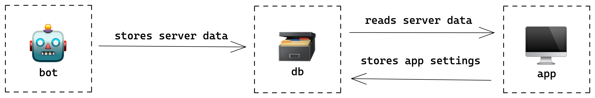

# `discord-server-info`

> Explore Discord server data and statistics

## Introduction

The information that Discord provides through
[Server Insights](https://support.discord.com/hc/en-us/articles/360032807371-Server-Insights-FAQ)
is inadequate for analyzing, reasoning about, and managing a complex Discord
server.

We created `discord-server-info` to help alleviate that problem.

For example, let's say you manage a large Discord and decide you want to require
all channels to have a `description` field so that other members can understand
at a glance the purpose of the channel.

How can you find a list of all of the channels missing a `description`?

You'll have to go through them one-by-one. Good luck!

Or: you can use `discord-server-info` (once it's built) to generate that list
for you!

## Technical Overview

To make this work, `discord-server-info` will need a few separate pieces:

- `bot`
- `db`
- `app`

`bot` is a Discord bot that reads data from the servers it's connected to and
stores it in the `db`.

`db` is a Prisma database that provides an API for storing app settings and
anonymized server data.

`app` is a Next.js application that allows users to authenticate with Discord
and explore data from their servers.

> If you're wondering why we need this structure rather than having the app read
> data directly from the Discord API, it's because the Discord API intentionally
> provides access to very little data. A bot account is required for full
> access.

This project will eventually be a monorepo with a package for each piece.
